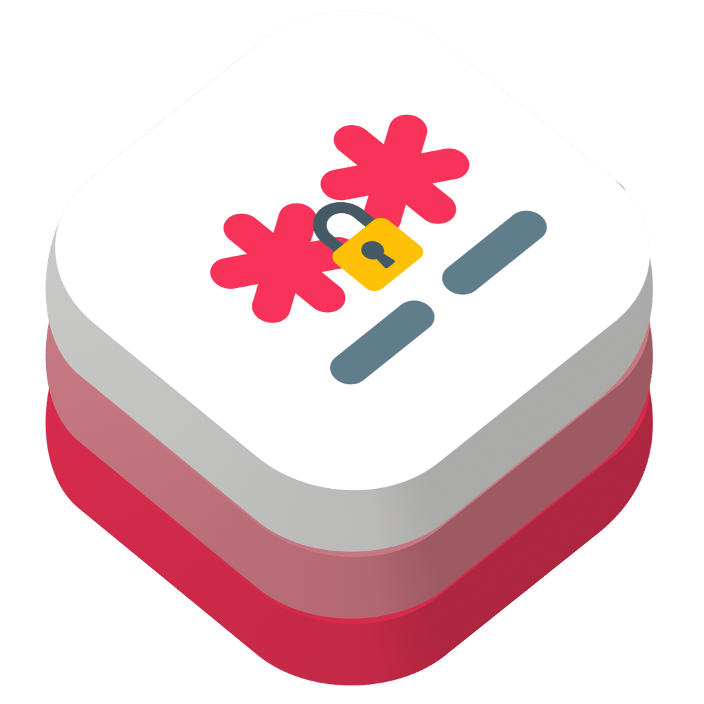

<p align="center">
    
</p>
<h1 align="center">StealthyStash</h1>

A Swifty database interface into the Keychain Services.

[](https://swift.org)
[](http://twitter.com/brightdigit)


[](https://swiftpackageindex.com/brightdigit/StealthyStash)
[](https://swiftpackageindex.com/brightdigit/StealthyStash)


[](https://codecov.io/gh/brightdigit/StealthyStash)
[](https://www.codefactor.io/repository/github/brightdigit/StealthyStash)
[](https://qlty.sh/gh/brightdigit/projects/StealthyStash)

# Table of Contents

* [Introduction](#introduction)
   * [Requirements](#requirements)
   * [Installation](#installation)
* [Usage](#usage)
   * [Further Documentation](#further-documentation)     
* [References](#references)
* [License](#license)

# Introduction

**StealthyStash** provides an pluggable easy abstract layer for accessing Keychain data as well as an API for encoding and decoding complex data in the Keychain. 

## Requirements 

**Apple Platforms**

- Xcode 14.3.1 or later
- Swift 5.8 or later
- iOS 14 / watchOS 7 / tvOS 14 / macOS 12 or later deployment targets

**Linux**

- Ubuntu 18.04 or later
- Swift 5.8 or later

## Installation

Use the Swift Package Manager to install this library via the repository url:

```
https://github.com/brightdigit/StealthyStash.git
```

Use version up to `1.0`.

# Usage

## Accessing the Keychain like a Database

**StealthyStash** supports the adding, updating, and querying for both generic and internet passwords. To do this you need to create a ``KeychainRepository`` to access the database to.

```
let repository = KeychainRepository(
  defaultServiceName: "com.brightdigit.KeychainSyncDemo",
  defaultServerName: "com.brightdigit.KeychainSyncDemo",
  defaultAccessGroup: "MLT7M394S7.com.brightdigit.KeychainSyncDemo"
)
```

To call ``KeychainRepository.init(defaultServiceName:defaultServerName:defaultAccessGroup:defaultSynchronizable:logger:)`` you need to supply a the default ``InternetPasswordItem/server`` and ``GenericPasswordItem/service`` which is required by both types to query and create.

> You can also supply a `logger` to use for logging as well as an ``InternetPasswordItem.accessGroup`` for your ``InternetPasswordItem`` and ``GenericPasswordItem.accessGroup`` for your ``GenericPasswordItem``

To query, update, or add a new password, check out the documentation under ``StealthyRepository``.

## Using `StealthyModel` for Composite Objects

In many cases, you may want to use multiple items to store a single object such as the user's password with ``InternetPasswordItem`` as well as their token via ``GenericPasswordItem``. In this case, you'll want to use a ``StealthyModel``:

```swift
struct CompositeCredentials: StealthyModel {
  typealias QueryBuilder = CompositeCredentialsQueryBuilder

  internal init(userName: String, password: String?, token: String?) {
    self.userName = userName
    self.password = password
    self.token = token
  }

  let userName: String

  let password: String?

  let token: String?
}
```

This is the perfect use case for ``StealthyModel`` and it only requires the implementation of a ``ModelQueryBuilder`` which defines how to build the queries for creating, updating, and deleting ``StealthyModel`` objects from the keychain:

* ``ModelQueryBuilder.updates(from:to:)`` require you to build an array of ``StealthyPropertyUpdate`` object which define the previous and new properties for the Keychain. Both the previous and new are optional in case you are only adding a new item as part of the update or only removing an old item.

* ``ModelQueryBuilder.properties(from:for:)`` is for creating a new model and requires the individual ``AnyStealthyProperty`` for each item to add to the keychain.

* ``ModelQueryBuilder.model(from:)`` builds the ``StealthyModel`` based on the ``AnyStealthyProperty`` items

* ``ModelQueryBuilder.queries(from:)`` builds a query dictionary depending the ``ModelQueryBuilder.QueryType`` passed. The keys to the query dictionary will be used by ``ModelQueryBuilder.model(from:)`` to define the keys of their resulting ``AnyStealthyProperty``. If there's only one object in your app, you can define ``ModelQueryBuilder.QueryType`` as `Void`:

```
static func queries(from _: Void) -> [String: Query] {
  [
    "password": TypeQuery(type: .internet),
    "token": TypeQuery(type: .generic)
  ]
}
```

For more help, take a look at the [`Sample` projects located in the Swift Package.](https://github.com/brightdigit/StealthyStash/tree/main/Samples)

## Further Documentation

Further documentation is available at [the Swift Package Index.](https://swiftpackageindex.com/brightdigit/StealthyStash/1.0.0/documentation/stealthystash)

# References

* [Using the Keychain to Manage User Secret](https://developer.apple.com/documentation/security/keychain_services/keychain_items/using_the_keychain_to_manage_user_secrets)

# License 

This code is distributed under the MIT license. See the [LICENSE](https://github.com/brightdigit/StealthyStash/LICENSE) file for more info.
